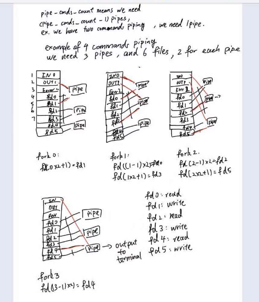

# Report

## Check for >>
The redirection logic is altered to check for another '>' symbol after 
the first one to see if the file will be overwritten or appended to.
Variable append is set to 1 if the second '>' symbol is present.

# sshell: Simple Shell
## 1. Summary
This program, `sshell` is a custom command line interpreter that can parse and execute basic commands such as cd, exit, pwd, and a custom sls command. 

It supports command pipes and output redirection. The code includes parsing user input, processing different types of commands, and the logic to execute these commands.

## 2. Implementation
The implementation of this program follows three distinct steps:
### 2.1 Parsing options
### 2.2 Pattern matching
#### 2.2.1 pipe
__outside source__ is viewed and studied to learn how to control mutiple pipe redirection. 
The `pipe_cmds_count` stores the number of piped commands from cmdNum in `split_command(...,split_indicator_pipe, &cmdNum)`. 
From this, we need `pipe_cmds_count - 1` pipes, (for example command1 | command2, we just need `the number of commands - 1` pipes)
for each pipe, we need two files to pipe them.
`pipe[fd + i * 2]` piped every two files, `fd[2i]->pipe read end`, `fd[2i+1]->pipe write end`
Then, step into creating processes using loop and fork and linking each pipe child to correct input and output.
```c
if  (i  !=  0){
dup2(fd[(i  -  1)  *  2],  STDIN_FILENO);
}
```
if it's not the first command, direct its STDIN to the Previous pipe write.
```c
if  (i  !=  pipe_cmds_count  -  1){
dup2(fd[i  *  2  +  1],  STDOUT_FILENO);
}
```
if it's not the last command, direct its STDOUT to current pipe read.  


After doing all of these, the pipe children are already to use `execvp` to execute their commands. And the last child will print it output to terminal. If it fails it will still use `exit(EXIT_FAILURE)` to exit.

### 2.3 Output and error

## 3. Cite outside source
### 3.1 knowing how to control pipe redirection
     `https://stackoverflow.com/questions/8389033/implementation-of-multiple-pipes-in-c`
